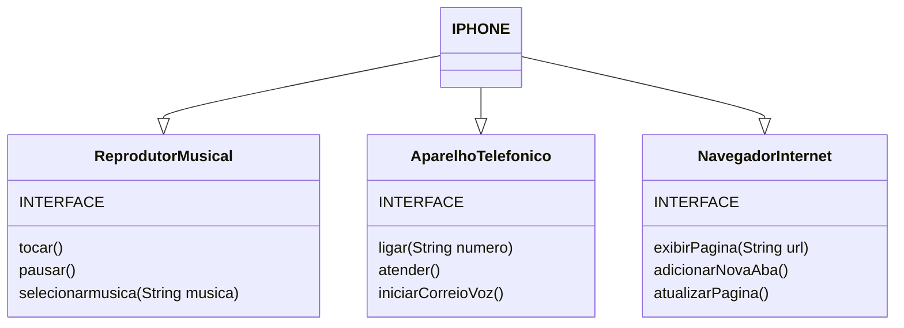

## Desafio Modelando o iPhone com UML: Funções de Músicas, Chamadas e Internet

Nesse desafio foi feito um modelo UML e o codigo.java seguindo as instruções sugeridas no projeto, eu optei por fazer com interfaces para que a classe IPHONE tivesse todas as funcionalidades das interfaces.

## Diagrama UML
   Segue abaixo o digrama criado no [mermaid](https://mermaid.js.org/)

.
